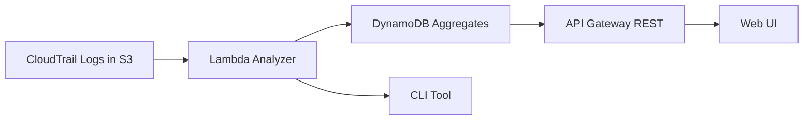

# IAM Least-Privilege Generator

A Python 3.11 serverless toolkit that ingests CloudTrail activity, aggregates service actions, and drafts least-privilege IAM policies for review.

## Architecture



- **CloudTrail S3 Bucket**: Stores raw audit trails and triggers the analyzer Lambda.
- **Analyzer Lambda**: Normalizes events with modules under `core/parser`, aggregates usage, and stores results.
- **DynamoDB**: Persists action summaries for API + UI retrieval.
- **API Gateway + Lambda**: Serves policy generation and statistics endpoints.
- **Web UI**: Reads API responses to visualize drift.
- **CLI**: Runs locally or in CI to validate logs and export policies.

## Repository Layout

```
infra/          # SAM + optional CDK/Terraform stacks
cli/            # Local + CI tooling (python -m iamlp.cli)
core/           # Domain models, parsing, aggregation, inference, policy logic
apiserver/      # Lambda handlers behind API Gateway
ui/public/      # Static web assets
tests/          # Pytest suites + CloudTrail fixtures
docs/           # Additional architecture, demo, compliance docs
```

## Getting Started

```bash
python -m venv .venv
source .venv/bin/activate
pip install -r requirements.txt
pip install -e .[dev]
```

Run unit tests: `pytest`. Lint and format: `ruff check` and `ruff format`.

## CLI Usage

- Analyze logs: `python -m iamlp.cli analyze --input tests/fixtures/cloudtrail/sample_event.json`
- Generate policy draft: `python -m iamlp.cli generate --analysis artifacts/analysis.json --format json`
- Inspect options: `python -m iamlp.cli --help`

Analysis output lands in `artifacts/` by default; edit defaults via `iamlp.yml` or pass `--config`.

## Serverless Deployment (AWS SAM)

1. Install the SAM CLI: `pip install aws-sam-cli`.
2. Build from `infra/sam-app/`: `sam build --use-container`.
3. Deploy interactively: `sam deploy --guided`.
4. Upload CloudTrail objects to the provisioned bucket to trigger the analyzer.
5. Point the UI and CLI to the emitted API Gateway endpoint.

## Demo Flow

1. Parse sample events with the CLI (see `docs/DEMO.md`).
2. Generate a policy and inspect the SARIF/JSON report.
3. Deploy the SAM stack and hit `/generate` + `/stats` endpoints with the CLI output.
4. Host `ui/public/` via S3 or CloudFront to visualize results.

Refer to `docs/ARCHITECTURE.md` for deeper design notes and `docs/COMPLIANCE.md` for control mappings.

## Edge Cases & Considerations

- **Cross-account AssumeRole**: The parser normalizes to the session issuer ARN so actions aggregate per true principal. Future work may add per-account summarisation when roles span multiple accounts.
- **Non resource-level actions**: When AWS does not permit scoping, generated statements default to `Resource: "*"`. Review and refine via allowlists as needed.
- **CloudTrail sampling/delay**: If delivery is lagged or batched, extend `--start/--end` windows and the dedupe logic preserves counts by principal/action.
- **Service Proxies**: Events triggered by service-linked roles (e.g., Glue -> S3) surface with the service role ARN; validate mapped principals before rollout.
- **Denied by SCP/Permission Boundaries**: Supply IAM context entries (`--cases` with `context` objects) for simulator runs to account for enterprise guardrails.
- **Limits**: ARN inference remains conservative and falls back to `*` when unable to determine specifics. Large data events may require batching/streaming, and false positives or misses should be mitigated using `--exclude-actions` and the new `--allow-actions` patterns.

## Definition of Done & Release Checklist

- `pytest` pass rate ≥ 90% and overall coverage ≥ 80%.
- `iamlp cli generate --mode resources` unit tests must validate ARN inference for *S3, DynamoDB, Lambda, KMS, Secrets Manager,* and *SSM.*
- Simulator-produced `diff.md` reports include at least four metrics: allowed action delta, resource concreteness ratio, AccessDenied change, and high-risk permission reductions.
- CI runs green and a release tag (`v0.1.0`) is published before deployment.

## Deployment

- **AWS SAM**: `sam build && sam deploy --guided --stack-name iamlp`
- **Teardown**: `sam delete --stack-name iamlp`
