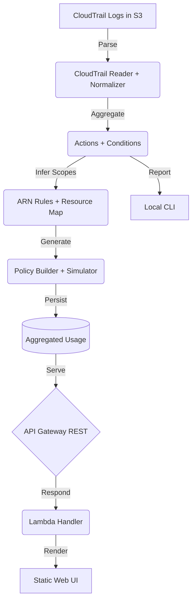

# Architecture Overview

The serverless core centers on a Python Lambda function packaged with shared `core/` modules. The function consumes batched CloudTrail events delivered via S3 notifications. Aggregated results are stored in DynamoDB for real-time retrieval by the API and Web UI. A CLI runs in CI or locally to validate policies prior to deployment.

Extend the system by adding more inference rules or policy templates under `core/` without modifying the Lambda wrapper.

### Definition of Done Snapshot

- `pytest` success rate ≥ 90% and line coverage ≥ 80% enforced by CI.
- `resources`-mode policy generation includes ARN inference tests for S3, DynamoDB, Lambda, KMS, Secrets Manager, and SSM services.
- Simulator diff output (`diff.md`) surfaces at least four metrics: allowed action delta, resource concreteness ratio, AccessDenied change, and high-risk service reduction count.
- GitHub Actions workflow passes and release tag `v0.1.0` is cut before production rollout.
